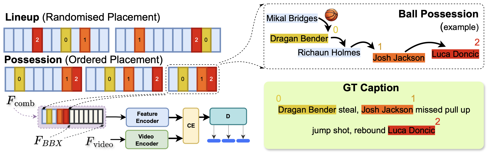

# [MMSports 2025] Towards Robust Identity Incorporation in Sports Video Captioning Systems


* Karol Wojtulewicz *<sup>1*</sup>, 
* Niklas Carlsson *<sup>1*</sup>, 

<sup>1</sup> Linköping University &nbsp;&nbsp;


<div align="center">
</img>
</div>

**Abstract**: Sports video analysis is a rapidly growing field. Yet, identity-aware, temporally grounded captioning, linking global player identities across fast, multi-agent interactions, remains underexplored. We address this gap with a novel method for integrating player identity into multimodal sports video models, improving captioning, action understanding, and player recognition. Our approach (1) employs triangular attention masking within modality encoders, capturing temporal inductive biases to better model action sequences and their causal flow, (2) proposes player token injection for global identity grounding, enabling the model to connect visual observations to named individuals, and (3) simulates ball possession sequences, mimicking real-world tracking data to strengthen the link between actions and involved players. Both combined and individually, each of these components allows us to significantly improve caption quality and player classification accuracy, as well as enhance the temporal comprehension in our multimodal data. Using extensive experimentation, we show that our method achieves substantial improvements over prior work (e.g., up-to 225% for some video captioning tasks and over 14× for some player recognition tasks), generalize to other domains, and provide insights into the best design tradeoffs. The results highlight a promising avenue for automated understanding and interpretation of dynamic sports content.

# Overview
This project and repository are based for the most part on *Sports Video Analysis on Large-Scale Data (ECCV2022)* paper. 

## Code Overview
The following sections contain scripts or PyTorch code for:

- A. Download pre-processed NSVA dataset.
- B. Training/evaluation script: (1) video captioning, (2) action recognition and (3) player identification.
- C. Pre-trained weigths.

## Install Dependencies

### Required Packages
* python>=3.9
* torch>=1.7.0 (with CUDA support)
* tqdm>=4.65.0
* boto3>=1.34.0
* requests>=2.31.0
* pandas>=2.2.0
* nlg-eval (Install Java 1.8.0 or higher first)
* pickle5
* wandb

### Installation

Create and activate the conda environment:
```bash
conda create -n univl python=3.9 tqdm boto3 requests pandas
conda activate univl
```

Install PyTorch (ensure you have CUDA support):
```bash
# For CUDA 11.7+ (adjust based on your CUDA version)
pip install torch>=1.7.0 torchvision torchaudio --index-url https://download.pytorch.org/whl/cu117
```

Install additional dependencies:
```bash
pip install pickle5 wandb
pip install git+https://github.com/Maluuba/nlg-eval.git@master
```

**Note**: This code requires CUDA support for GPU acceleration.

**Troubleshooting**: If you encounter any installation issues, please refer to the original [NSVA repository](https://github.com/jackwu502/NSVA) for additional guidance and alternative setup instructions.

## Environment Configuration

Create a `.env` file in the project root directory with the following variable:

```bash
DIR_PATH=/path/to/your/NSVA_Clean/NSVA
```

Replace `/path/to/your/NSVA_Clean/NSVA` with the actual absolute path to your project directory. This variable is used by the scripts to locate data files and other resources.

## Prepare the Dataset

### Base Dataset
The base NSVA dataset files should be downloaded as described in the original NSVA repository at this [link](https://github.com/jackwu502/NSVA/tree/main/SportsFormer/data). This includes the core video features, training/validation CSV files, and description JSON files.

### Complementary Files for Identity Features
Additional data files required for player identity features (CLIP embeddings, player tokens, possession sequences, etc.) and pre-trained model weights are available at:

**[PLACEHOLDER: https://github.com/your-username/NSVA-identity-data]**

Download and place:
- **Data files** in the `data/` directory
- **Pre-trained model weights** in the `weight/` directory

The complementary data package includes:
- CLIP-based player embeddings
- Ball possession sequence data
- Updated description JSON files with identity annotations
- Pre-trained model checkpoints for evaluation

## Running the Models

All three main task scripts (`main_task_caption.py`, `main_task_action.py`, and `main_task_player.py`) now support command-line arguments for flexible configuration. Below are examples for each task.

### Video Captioning

Train from scratch with identity features:
```bash
python main_task_caption.py \
  --do_train \
  --num_thread_reader 0 \
  --epochs 20 \
  --batch_size 48 \
  --batch_size_val 16 \
  --n_display 300 \
  --train_csv data/ourds_train.44k.csv \
  --val_csv data/ourds_JSFUSION_test.csv \
  --data_path data/new_ourds_description_only.json \
  --features_path data/ourds_videos_timesformer_features.pickle \
  --bbx_features_path data/cls2_ball_basket_sum_concat_original_courtline_fea_1.pickle \
  --output_dir ckpt_ourds_caption \
  --bert_model bert-base-uncased \
  --do_lower_case \
  --lr 3e-5 \
  --max_words 30 \
  --max_frames 48 \
  --visual_num_hidden_layers 6 \
  --decoder_num_hidden_layers 3 \
  --cross_num_hidden_layers 3 \
  --datatype ourds-CLIP \
  --stage_two \
  --video_dim 768 \
  --init_model weight/univl.pretrained.bin \
  --train_tasks 0,0,1,0 \
  --test_tasks 0,0,1,0
```

Evaluate with a pre-trained model:

**Note**: Download the pre-trained caption model from the complementary files repository (link above) and place it in `weight/best_model_caption_identity.bin` before running evaluation.

```bash
python main_task_caption.py \
  --do_eval \
  --num_thread_reader 0 \
  --batch_size_val 16 \
  --train_csv data/ourds_train.44k.csv \
  --val_csv data/ourds_JSFUSION_test.csv \
  --data_path data/new_ourds_description_only.json \
  --features_path data/ourds_videos_timesformer_features.pickle \
  --bbx_features_path data/cls2_ball_basket_sum_concat_original_courtline_fea_1.pickle \
  --output_dir ckpt_ourds_caption \
  --bert_model bert-base-uncased \
  --do_lower_case \
  --max_words 30 \
  --max_frames 48 \
  --visual_num_hidden_layers 6 \
  --decoder_num_hidden_layers 3 \
  --cross_num_hidden_layers 3 \
  --datatype ourds-CLIP \
  --stage_two \
  --video_dim 768 \
  --init_model weight/best_model_caption_identity.bin \
  --train_tasks 0,0,1,0 \
  --test_tasks 0,0,1,0
```

**Results** reproduced from pre-trained model 

| **Model Type**  | **C**  | **M** | **B@4** | **R_L** |
| -----------------------------| ------- |  ----------| ----------| ----------|
| **Triang Attn Masking** | **1.1340**   | **0.2480**    |**0.2470**    |**0.5130** |
| **Triang+Lineup** | **1.4300**   | **0.2527**    |**0.2552**    |**0.5185** |
| **Triang+Possession** | **3.704**   | **0.3283**    |**0.4021**    |**0.6477** |

### Action Recognition

Train from scratch with identity features (fine-grained actions):
```bash
python main_task_action.py \
  --do_train \
  --num_thread_reader 4 \
  --epochs 20 \
  --batch_size 32 \
  --batch_size_val 16 \
  --n_display 300 \
  --train_csv data/ourds_train.44k.csv \
  --val_csv data/ourds_JSFUSION_test.csv \
  --data_path data/ourds_description.json \
  --features_path data/ourds_videos_timesformer_features.pickle \
  --bbx_features_path data/cls2_ball_basket_sum_concat_original_courtline_fea_1.pickle \
  --output_dir output/ckpt_ourds_action_fine \
  --bert_model bert-base-uncased \
  --do_lower_case \
  --lr 3e-5 \
  --max_words 30 \
  --max_frames 30 \
  --visual_num_hidden_layers 3 \
  --decoder_num_hidden_layers 6 \
  --cross_num_hidden_layers 3 \
  --datatype ourds-CLIP \
  --stage_two \
  --video_dim 768 \
  --init_model weight/univl.pretrained.bin \
  --train_tasks 0,1,0,0 \
  --test_tasks 0,1,0,0 \
  --action_level 1
```

For coarse-grained actions, use `--action_level 2`. For event-level actions, use `--action_level 0`.

Evaluate with a pre-trained model:

**Note**: Download the pre-trained action recognition models from the complementary files repository (link above) and place them in the `weight/` directory before running evaluation.

```bash
# For fine-grained action recognition
python main_task_action.py \
  --do_eval \
  --num_thread_reader 4 \
  --batch_size_val 16 \
  --train_csv data/ourds_train.44k.csv \
  --val_csv data/ourds_JSFUSION_test.csv \
  --data_path data/ourds_description.json \
  --features_path data/ourds_videos_timesformer_features.pickle \
  --bbx_features_path data/cls2_ball_basket_sum_concat_original_courtline_fea_1.pickle \
  --output_dir output/ckpt_ourds_action_fine \
  --bert_model bert-base-uncased \
  --do_lower_case \
  --max_words 30 \
  --max_frames 30 \
  --visual_num_hidden_layers 3 \
  --decoder_num_hidden_layers 6 \
  --cross_num_hidden_layers 3 \
  --datatype ourds-CLIP \
  --stage_two \
  --video_dim 768 \
  --init_model weight/best_model_action_fine_identity.bin \
  --train_tasks 0,1,0,0 \
  --test_tasks 0,1,0,0 \
  --action_level 1
```

**Results** reproduced from pre-trained model 

| **Action Recognition**  | **SuccessRate**  | **mAcc.** | **mIoU** |
| -----------------------------| ------- | -------- |----------| 
| **Our full model Coarse** | **77.87**   | **85.44**    | **88.10**    |
| **Our full model Fine** | **39.51**   | **55.79**    | **64.85**    |
| **Our full model Event** | **39.20**   | **58.54**    | **69.38**    |

### Player Identification

Train from scratch with identity features:
```bash
python main_task_player.py \
  --do_train \
  --num_thread_reader 4 \
  --epochs 20 \
  --batch_size 32 \
  --batch_size_val 16 \
  --n_display 300 \
  --train_csv data/ourds_train.44k.csv \
  --val_csv data/ourds_JSFUSION_test.csv \
  --data_path data/ourds_description.json \
  --features_path data/ourds_videos_timesformer_features.pickle \
  --bbx_features_path data/cls2_ball_basket_sum_concat_original_courtline_fea_1.pickle \
  --output_dir output/ckpt_ourds_player \
  --bert_model bert-base-uncased \
  --do_lower_case \
  --lr 3e-5 \
  --max_words 30 \
  --max_frames 30 \
  --visual_num_hidden_layers 3 \
  --decoder_num_hidden_layers 6 \
  --cross_num_hidden_layers 3 \
  --datatype ourds-CLIP \
  --stage_two \
  --video_dim 768 \
  --init_model weight/univl.pretrained.bin \
  --train_tasks 1,0,0,0 \
  --test_tasks 1,0,0,0
```

Evaluate with a pre-trained model:

**Note**: Download the pre-trained player identification model from the complementary files repository (link above) and place it in `weight/best_model_player_identity.bin` before running evaluation.

```bash
python main_task_player.py \
  --do_eval \
  --num_thread_reader 4 \
  --batch_size_val 16 \
  --train_csv data/ourds_train.44k.csv \
  --val_csv data/ourds_JSFUSION_test.csv \
  --data_path data/ourds_description.json \
  --features_path data/ourds_videos_timesformer_features.pickle \
  --bbx_features_path data/cls2_ball_basket_sum_concat_original_courtline_fea_1.pickle \
  --output_dir output/ckpt_ourds_player \
  --bert_model bert-base-uncased \
  --do_lower_case \
  --max_words 30 \
  --max_frames 30 \
  --visual_num_hidden_layers 3 \
  --decoder_num_hidden_layers 6 \
  --cross_num_hidden_layers 3 \
  --datatype ourds-CLIP \
  --stage_two \
  --video_dim 768 \
  --init_model weight/best_model_player_identity.bin \
  --train_tasks 1,0,0,0 \
  --test_tasks 1,0,0,0
```

**Note**: The task configuration uses a 4-element array `[T1, T2, T3, T4]` where:
- T1 = Player Recognition
- T2 = Action Prediction (Recognition)
- T3 = Description Generation
- T4 = Commentary Generation

Set the corresponding value to 1 to enable that task, 0 to disable.

### Training Information

The pre-trained models provided were trained on a **single NVIDIA RTX 3090 GPU** with approximately **8 hours** of training time per task.

**Multi-GPU Training**: If you have access to multiple GPUs and want to accelerate training, please refer to the original [NSVA repository](https://github.com/jackwu502/NSVA) for instructions on distributed training across multiple GPUs.

**Results** reproduced from pre-trained model 

| **Model Type**  | **SuccessRate**  | **mAcc.** | **mIoU** |
| -----------------------------| ------- | -------- |----------|
| **Triang Attn Masking** | **5.06**   | **9.34**    | **23.42**    | 
| **Triang+Lineup** | **11.56**   | **26.26**    | **30.20**    | 
| **Triang+Possession** | **67.89**   | **73.76**    | **74.45**    | 


## Downloading Raw Videos

If you would like to download the raw MP4 videos from the NSVA dataset or additional videos from NBA.com, please refer to the video downloading tools and instructions in the original [NSVA repository](https://github.com/jackwu502/NSVA). The repository provides detailed scripts and documentation for video collection.

## Citation

If you find this code useful in your work then please cite

```bibtex
@inproceedings{10.1145/3728423.3759411,
author = {Wojtulewicz, Karol and Carlsson, Niklas},
title = {Towards Robust Identity Incorporation in Sports Video Captioning Systems},
year = {2025},
isbn = {9798400711985},
publisher = {Association for Computing Machinery},
address = {New York, NY, USA},
url = {https://doi.org/10.1145/3728423.3759411},
doi = {10.1145/3728423.3759411},
booktitle = {Proceedings of the 8th International ACM Workshop on Multimedia Content Analysis in Sports},
pages = {18–30},
numpages = {13},
keywords = {action recognition, identity grounding, temporal comprehension, triangular attention masking, video captioning},
location = {Dublin, Ireland},
series = {MMSports '25}
}
```

## Acknowledgement
This code base is largely from [NSVA repository](https://github.com/jackwu502/NSVA). Many thanks to the authors.

## License

The majority of this work which includes code and data is licensed under [Creative Commons Attribution-NonCommercial (CC-BY-NC) license](http://creativecommons.org/licenses/by-nc/4.0/). However part of the project is available under a separate license term: [UniVL](https://github.com/microsoft/UniVL) is licensed under the [MIT license](https://github.com/microsoft/UniVL/blob/main/LICENSE).

## Contact
Please contact Karol Wojtulewicz @ karwo09@liu.se, if any issue.

